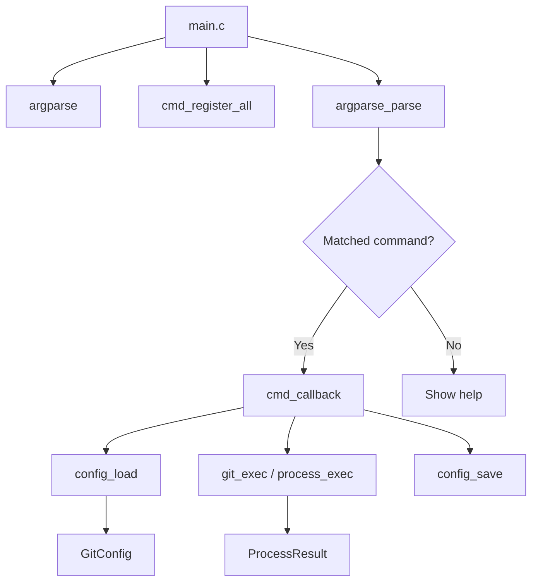

# DEV.md

Developer guide for contributors and maintainers.

## Architecture Overview

gitm is a single-process, single-threaded CLI tool. There is no server, no networking, and no async model. Every operation is synchronous.



### Major Components

| Component             | Location              | Responsibility                                                                          |
| --------------------- | --------------------- | --------------------------------------------------------------------------------------- |
| **Entry point**       | `src/main.c`          | Parser init, global options, `--edit-entry` handler, dispatch                           |
| **Commands**          | `src/commands/`       | One file per subcommand, each with a callback and registration function                 |
| **Command registry**  | `src/commands/cmd.c`  | Central `cmd_register_all()`, shared `g_table_mode`, `cmd_register_table_flag()`        |
| **Config**            | `src/config/config.c` | Load, save, validate, add, remove, rename, tag/group/orphan helpers                     |
| **Git execution**     | `src/git/git.c`       | Variadic `git_exec()` wrapper, `git_is_repo()`, `git_current_branch()`                  |
| **Process execution** | `src/git/process.c`   | `fork()`/`execvp()` with stdout/stderr pipe capture                                     |
| **Logger**            | `src/util/log.c`      | Seven severity levels (off–trace), ANSI colour, optional timestamps and source location |
| **Table formatter**   | `src/util/table.c`    | Auto-width, pipe-separated columns with ANSI-aware width calculation                    |
| **Argparse**          | `argparse/`           | Standalone library — nested subcommands, shell completion, coloured help                |

### Data Flow

1. User runs `gitm <command> [options]`
2. `main.c` creates an `ArgParser`, registers global options and all subcommands
3. `argparse_parse()` matches a command and calls its callback
4. The callback calls `config_default_path()` → `config_load()` to load the registry
5. For batch commands, the callback iterates `cfg.entries[]` and calls `git_exec()` per repo
6. For single-repo commands, the callback calls `config_find()` to resolve a name
7. Results are printed to stderr (coloured) or stdout (plain); `--table` mode uses the table formatter
8. If the command mutated the config, `config_save()` writes it back

## Build System

Single `Makefile`, no autotools or CMake.

### Build Targets

| Target           | Description                                              |
| ---------------- | -------------------------------------------------------- |
| `make`           | Release build, `-O3`, outputs `./gitm`                   |
| `make debug`     | Debug build, `-g3`, ASan, UBSan, source location logging |
| `make clean`     | Remove build artifacts                                   |
| `make install`   | Install to `$(PREFIX)/bin` (default `/usr/local`)        |
| `make uninstall` | Remove installed binary                                  |
| `make format`    | Run `clang-format` on all source files                   |
| `make strip`     | Strip debug symbols from binary                          |

### Build Options

Set via command line: `make O_DEBUG=1`

| Variable                     | Default | Description                               |
| ---------------------------- | ------- | ----------------------------------------- |
| `O_DEBUG`                    | `0`     | Enable debug build (ASan, UBSan, `-g3`)   |
| `O_LOG_SHOW_SOURCE_LOCATION` | `0`     | Prepend `[file:line:func]` to log output  |
| `O_LOG_SHOW_TIME_STAMP`      | `0`     | Prepend `[HH:MM:SS.ffffff]` to log output |

Running `make debug` auto-enables all three.

### Config File Location

Resolution order:
1. `$XDG_DATA_HOME/gitm/registered_repos.txt` (if `XDG_DATA_HOME` is set)
2. macOS: `~/Library/Application Support/gitm/registered_repos.txt`
3. Linux: `~/.local/share/gitm/registered_repos.txt`

Parent directories are created automatically via `config_ensure_dir()` (called by `add`, `clone`, and `--edit-entry`).

### Compiler Flags

- Standard: `-std=c17`
- Warnings: `-Wall -Wextra -Wpedantic -Wshadow -Wconversion -Wstrict-prototypes -Wmissing-prototypes`
- Include paths: `-Isrc -Iinclude -Iargparse/include`

### Generated Files

| File                    | Generated by          |
| ----------------------- | --------------------- |
| `build/`                | Object files (`.o`)   |
| `gitm`                  | Final binary          |
| `compile_commands.json` | `bear make` (if used) |

## Concurrency

There is no concurrency. gitm is single-threaded and single-process (aside from `fork()` for child git processes). Each `git_exec()` call forks a child, waits for it to complete, then continues. No worker pools, no async, no threading.

## Repository Layout

```
gitm/
├── Makefile                    # Build system
├── include/                    # Public headers
│   ├── config.h                # GitConfig / RepoEntry API
│   ├── cmd.h                   # cmd_register_all(), g_table_mode, cmd_register_table_flag()
│   ├── git.h                   # git_exec() and helpers
│   ├── process.h               # process_exec() API
│   ├── log.h                   # Logger macros and API (7 levels: off–trace)
│   ├── table.h                 # Table formatter API (table_create, table_add_row, table_print)
│   ├── str_util.h              # String utility functions (renamed from string.h to avoid shadowing)
│   ├── project_config.h        # Version, name, description constants
│   └── ansi_color.h            # ANSI escape code macros
├── src/
│   ├── main.c                  # Entry point
│   ├── commands/               # One file per subcommand
│   │   ├── cmd.c               # Registration hub + shared g_table_mode
│   │   ├── add.c               # gitm add
│   │   ├── remove.c            # gitm remove
│   │   ├── status.c            # gitm status (colourised + table mode)
│   │   └── ... (17 files)
│   ├── config/
│   │   └── config.c            # All config logic
│   ├── git/
│   │   ├── process.c           # fork/exec wrapper
│   │   └── git.c               # Git helper functions
│   └── util/
│       ├── log.c               # Logger implementation
│       └── table.c             # Table formatter implementation
└── argparse/                   # Standalone argument parser
    ├── include/argparse.h
    ├── DOC.md
    ├── DOC_IN_DEPTH.md
    └── src/
        ├── argparse.c          # Core parser
        ├── lexer.c / lexer.h   # Argv tokenizer
        ├── help.c              # Coloured help output
        └── error.c / error.h   # Error messages + Levenshtein
```

## Development Guidelines

### Code Style

- C17 standard, tabs for indentation (4-width), 100-column limit
- Format with `make format` (uses `.clang-format`)
- Header guards: `_NAME_H_` pattern
- MIT license header on every `.c` and `.h` file

### Adding a Command

1. Create `src/commands/mycommand.c`
2. Implement `int cmd_mycommand(const ArgParseResult *result)`
3. Implement `void cmd_register_mycommand(ArgParser *parser)`
4. Add `extern void cmd_register_mycommand(ArgParser *parser);` to `src/commands/cmd.c`
5. Call `cmd_register_mycommand(parser);` in `cmd_register_all()`
6. If the command supports `--table`, call `cmd_register_table_flag(cmd)` on the `ArgCommand *cmd`
7. Run `make` to verify

### Logging

Use the `LOG_*` macros from `log.h`:

```c
LOG_ERROR("could not open file: %s", path);
LOG_WARN("skipping malformed entry");
LOG_INFO("added %s", name);
LOG_DEBUG("config has %zu entries", cfg.count);
LOG_TRACE("entering %s", __func__);
```

Seven severity levels (high → low): `off`, `fatal`, `error`, `warn`, `info`, `debug`, `trace`. Default level is `warn`.

Output goes to stderr by default, or to a file if `--log-file` is specified.

### Table Output

For commands that support `--table`, use the table API:

```c
if (g_table_mode) {
    const char *headers[] = { "Name", "Status", "Branch" };
    Table *t = table_create(3, headers);
    table_set_color(t, log_use_color());

    table_add_row(t, "my-repo", "clean", "main");
    table_add_row_raw(t, (const char *[]){"my-repo", "\x1b[32mclean\x1b[0m", "main"}, 3);

    table_print(t, stdout);
    table_free(t);
}
```

Register the flag in `cmd_register_mycommand()`:

```c
cmd_register_table_flag(cmd);
```

### Error Handling

- Functions return `0` on success, `-1` on error
- Errors are logged via `LOG_ERROR()` and printed to stderr
- `config_load()` returns `0` for missing files (not an error — produces empty config)
- `git_exec()` returns a `ProcessResult` with `exit_code` — callers check the exit code

### Testing

There is no test suite. Verify changes by:

1. `make clean && make` — ensure it compiles with no warnings
2. Run each affected command manually
3. Use `make debug -B` for ASan/UBSan checks

For deeper implementation details, see [DEV_IN_DEPTH.md](DEV_IN_DEPTH.md).
