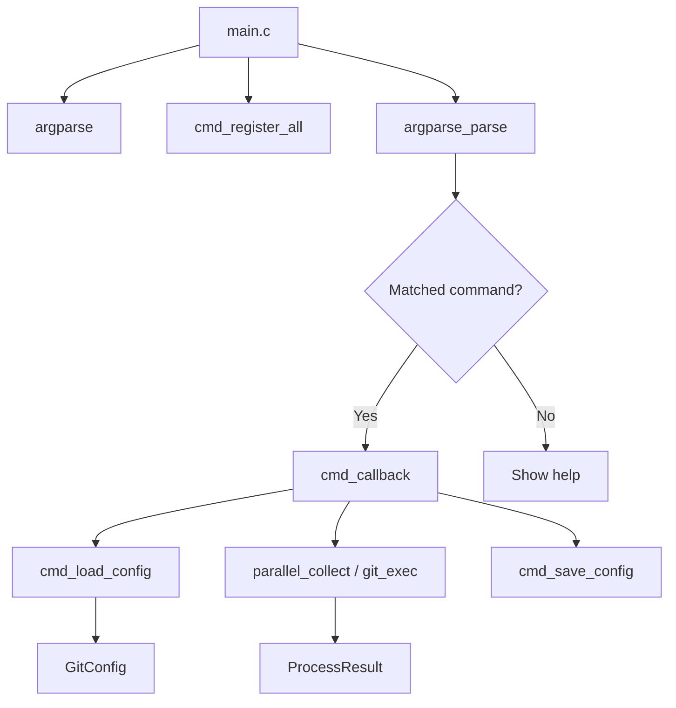

# DEV.md

Developer guide for contributors and maintainers.

## Architecture Overview

gitm is a single-process CLI tool. There is no server and no networking. Child git processes are forked and waited on synchronously. Per-repo data collection uses a pthread-based thread pool for parallel execution.


```mermaid
flowchart TD
    A[main.c] --> B[argparse]
    A --> C[cmd_register_all]
    A --> D[argparse_parse]
    D --> E{Matched command?}
    E -->|Yes| F[cmd_callback]
    E -->|No| G[Show help]
    F --> H[cmd_load_config]
    F --> I[parallel_collect / git_exec]
    H --> J[GitConfig]
    I --> K[ProcessResult]
    F --> L[cmd_save_config]
```

### Major Components

| Component             | Location              | Responsibility                                                                          |
| --------------------- | --------------------- | --------------------------------------------------------------------------------------- |
| **Entry point**       | `src/main.c`          | Parser init, global options, `--edit-entry` handler, dispatch                           |
| **Commands**          | `src/commands/`       | One file per subcommand, each with a callback and registration function                 |
| **Command registry**  | `src/commands/cmd.c`  | Central `cmd_register_all()`, shared `g_table_mode`, `cmd_register_table_flag()`        |
| **Command utilities** | `src/commands/cmd_util.c` | `cmd_load_config()`, `cmd_filter_entries()`, `cmd_print_name_path()`, `cmd_cleanup()` |
| **Config**            | `src/config/`         | 5 files: core load/save, path resolution, CRUD, tag/group matching, validation          |
| **Git execution**     | `src/git/git.c`       | Variadic `git_exec()` wrapper, `git_exec_color()`, `git_is_repo()`, etc.               |
| **Process execution** | `src/git/process.c`   | `fork()`/`execvp()` with `poll()`-based concurrent stdout/stderr capture                |
| **Shared utilities**  | `src/share.c`         | Constants, ANSI helpers, date parsing, `cmd_save_config()`, `cmd_cleanup()`             |
| **Parallel execution**| `src/util/parallel.c` | Thread pool (`src/util/thread_pool.c`), `parallel_collect()` for per-repo concurrency   |
| **Logger**            | `src/util/log.c`      | Seven severity levels (off–trace), ANSI colour, optional timestamps and source location |
| **Table formatter**   | `src/util/table.c`    | Auto-width, pipe-separated columns with ANSI-aware width calculation                    |
| **Argparse**          | `argparse/`           | Standalone library — nested subcommands, shell completion, coloured help                |

### Data Flow

1. User runs `gitm <command> [options]`
2. `main.c` creates an `ArgParser`, registers global options and all subcommands
3. `argparse_parse()` matches a command and calls its callback
4. The callback calls `cmd_load_config(&cfg, &config_path)` to load the registry
5. For batch commands, the callback calls `parallel_collect()` which distributes per-repo work across a thread pool
6. For single-repo commands, the callback calls `config_find()` to resolve a name
7. Results are printed to stderr (coloured) or stdout (plain); `--table` mode uses the table formatter
8. If the command mutated the config, `cmd_save_config(&cfg, config_path)` writes it back
9. Cleanup via `cmd_cleanup(&cfg, config_path)` frees config and path string

## Build System

Single `Makefile`, no autotools or CMake.

### Build Targets

| Target           | Description                                              |
| ---------------- | -------------------------------------------------------- |
| `make`           | Release build, `-O3`, outputs `./gitm`                   |
| `make debug`     | Debug build, `-g3`, ASan, UBSan, source location logging |
| `make clean`     | Remove build artifacts                                   |
| `make install`   | Install binary to `$(PREFIX)/bin` and man page to `$(MANPREFIX)/man1/` |
| `make uninstall` | Remove installed binary and man page                                  |
| `make format`    | Run `clang-format` on all source files                   |
| `make strip`     | Strip debug symbols from binary                          |

### Build Options

Set via command line: `make O_DEBUG=1`

| Variable                     | Default | Description                               |
| ---------------------------- | ------- | ----------------------------------------- |
| `O_DEBUG`                    | `0`     | Enable debug build (ASan, UBSan, `-g3`)   |
| `O_LOG_SHOW_SOURCE_LOCATION` | `0`     | Prepend `[file:line:func]` to log output  |
| `O_LOG_SHOW_TIME_STAMP`      | `0`     | Prepend `[HH:MM:SS.ffffff]` to log output |

Running `make debug` auto-enables all three.

### Config File Location

Resolution order:
1. `$XDG_DATA_HOME/gitm/registered_repos.txt` (if `XDG_DATA_HOME` is set)
2. macOS: `~/Library/Application Support/gitm/registered_repos.txt`
3. Linux: `~/.local/share/gitm/registered_repos.txt`

Parent directories are created automatically via `config_ensure_dir()` (called by `add`, `clone`, and `--edit-entry`).

### Compiler Flags

- Standard: `-std=c17`
- Warnings: `-Wall -Wextra -Wpedantic -Wshadow -Wconversion -Wstrict-prototypes -Wmissing-prototypes`
- Include paths: `-Isrc -Iinclude -Iargparse/include`
- Linker: `-lpthread` (required for parallel execution)

### Generated Files

| File                    | Generated by          |
| ----------------------- | --------------------- |
| `build/`                | Object files (`.o`)   |
| `gitm`                  | Final binary          |
| `compile_commands.json` | `bear make` (if used) |

## Concurrency

Per-repo data collection uses a pthread-based thread pool for parallel execution. The thread pool (`src/util/thread_pool.c`) uses a ring-buffer design with max 64 pending tasks and 16 worker threads.

Thread count is controlled by the `GITM_THREADS` environment variable, defaulting to `min(sysconf(_SC_NPROCESSORS_ONLN), 8)`, clamped to [1, 16].

Ten commands use `parallel_collect()`: `status`, `branch`, `last`, `recent`, `remote`, `list-tag`, `summary`, `doctor`, `stale`, `stash`.

Individual `git_exec()` calls still fork a child and wait for it synchronously. The parallelism is at the repo level (each repo is processed by a different thread), not at the git-command level.

## Repository Layout

```
gitm/
├── Makefile                    # Build system
├── gitm.1                      # Man page (mdoc format)
├── include/                    # Public headers
│   ├── config.h                # GitConfig / RepoEntry API
│   ├── cmd.h                   # cmd_register_all(), g_table_mode, cmd_register_table_flag()
│   ├── cmd_util.h              # Shared command helpers (cmd_load_config, cmd_filter_entries, etc.)
│   ├── git.h                   # git_exec(), git_exec_color(), git_is_repo(), etc.
│   ├── process.h               # process_exec(), process_exec_colored(), ProcessResult, CmdGitResult
│   ├── share.h                 # Central constants (MAX_REPOS, MSG_*), ANSI helpers, date parsing
│   ├── parallel.h              # Thread pool API, parallel_collect()
│   ├── thread_pool.h           # tp_create(), tp_submit(), tp_wait(), tp_destroy()
│   ├── log.h                   # Logger macros and API (7 levels: off–trace)
│   ├── table.h                 # Table formatter API (table_create, table_add_row, table_print)
│   ├── str_util.h              # String utility functions (renamed from string.h to avoid shadowing)
│   ├── project_config.h        # Version, name, description constants
│   └── ansi_color.h            # ANSI escape code macros
├── src/
│   ├── main.c                  # Entry point
│   ├── share.c                 # Shared utilities (ANSI, date parsing, cmd_cleanup, cmd_save_config)
│   ├── commands/               # One file per subcommand (23 files)
│   │   ├── cmd.c               # Registration hub + shared g_table_mode
│   │   ├── cmd_util.c          # Shared command helpers (cmd_load_config, cmd_filter_entries)
│   │   ├── add.c               # gitm add
│   │   ├── branch.c            # gitm branch
│   │   ├── clean.c             # gitm clean
│   │   ├── clone.c             # gitm clone (WIP, not registered)
│   │   ├── doctor.c            # gitm doctor
│   │   ├── exec.c              # gitm exec
│   │   ├── info.c              # gitm info
│   │   ├── last.c              # gitm last
│   │   ├── list.c              # gitm list
│   │   ├── list_tag.c          # gitm list-tag
│   │   ├── open.c              # gitm open
│   │   ├── recent.c            # gitm recent
│   │   ├── remote.c            # gitm remote
│   │   ├── remove.c            # gitm remove
│   │   ├── rename.c            # gitm rename
│   │   ├── search.c            # gitm search
│   │   ├── stale.c             # gitm stale (WIP, not registered)
│   │   ├── stash.c             # gitm stash (WIP, not registered)
│   │   ├── stats.c             # gitm stats
│   │   ├── status.c            # gitm status (colourised + table mode)
│   │   └── summary.c           # gitm summary
│   ├── config/                 # Config system (5 files)
│   │   ├── config.c            # Core load/save/free
│   │   ├── path.c              # config_default_path(), config_ensure_dir()
│   │   ├── crud.c              # config_add, config_remove, config_rename, config_find
│   │   ├── tags.c              # config_entry_has_tag, config_entry_has_group
│   │   └── validate.c          # config_validate, config_find_orphans, config_remove_at_indices
│   ├── git/
│   │   ├── process.c           # fork/exec with poll()-based I/O, SIGPIPE handling
│   │   └── git.c               # Git helper functions (7 functions)
│   └── util/
│       ├── log.c               # Logger implementation
│       ├── table.c             # Table formatter implementation
│       ├── parallel.c          # parallel_collect() coordinator
│       └── thread_pool.c       # Ring-buffer thread pool implementation
└── argparse/                   # Standalone argument parser
    ├── include/argparse.h
    ├── DOC.md
    ├── DOC_IN_DEPTH.md
    └── src/
        ├── argparse.c          # Core parser
        ├── lexer.c / lexer.h   # Argv tokenizer
        ├── help.c              # Coloured help output
        └── error.c / error.h   # Error messages + Levenshtein
```

## Development Guidelines

### Code Style

- C17 standard, tabs for indentation (4-width), 100-column limit
- Format with `make format` (uses `.clang-format`)
- Header guards: `_NAME__H_` pattern
- MIT license header on every `.c` and `.h` file

### Adding a Command

1. Create `src/commands/mycommand.c`
2. Implement `int cmd_mycommand(const ArgParseResult *result)`
3. Implement `void cmd_register_mycommand(ArgParser *parser)`
4. Add `extern void cmd_register_mycommand(ArgParser *parser);` to `src/commands/cmd.c`
5. Call `cmd_register_mycommand(parser);` in `cmd_register_all()`
6. If the command supports `--table`, call `cmd_register_table_flag(cmd)` on the `ArgCommand *cmd`
7. If the command supports `--tag`/`--group` filtering, call `cmd_register_filter_flags(cmd, &filter_tag, &filter_group)`
8. Run `make` to verify

### Logging

Use the `LOG_*` macros from `log.h`:

```c
LOG_ERROR("could not open file: %s", path);
LOG_WARN("skipping malformed entry");
LOG_INFO("added %s", name);
LOG_DEBUG("config has %zu entries", cfg.count);
LOG_TRACE("entering %s", __func__);
```

Seven severity levels (high → low): `off`, `fatal`, `error`, `warn`, `info`, `debug`, `trace`. Default level is `warn`.

Output goes to stderr by default, or to a file if `--log-file` is specified.

### Table Output

For commands that support `--table`, use the table API:

```c
if (g_table_mode) {
    const char *headers[] = { "Name", "Status", "Branch" };
    Table *t = table_create(3, headers);
    table_set_color(t, CMD_COLOR());

    table_add_row(t, "my-repo", "clean", "main");
    table_add_row_raw(t, (const char *[]){"my-repo", "\x1b[32mclean\x1b[0m", "main"}, 3);

    table_print(t, stdout);
    table_free(t);
}
```

Register the flag in `cmd_register_mycommand()`:

```c
cmd_register_table_flag(cmd);
```

### Error Handling

- Functions return `0` on success, `-1` on error
- Errors are logged via `LOG_ERROR()` and printed to stderr
- `cmd_load_config()` resolves the path, loads the config, and handles errors in one call
- `git_exec()` returns a `ProcessResult` with `exit_code` — callers check the exit code
- `cmd_cleanup()` frees the config and path string — always call this instead of `config_free()` directly

### Testing

There is no test suite. Verify changes by:

1. `make clean && make` — ensure it compiles with no warnings
2. Run each affected command manually
3. Use `make debug -B` for ASan/UBSan checks

For deeper implementation details, see [DEV_IN_DEPTH.md](DEV_IN_DEPTH.md).
